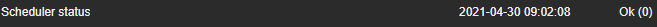
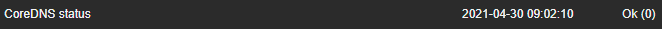

# ZABBIX Kubernetes checks
The ZABBIX Kubernetes checks provide UserParameters and keys to monitor a multitude of Kubernetes components.

## Implementation
To be able to use these checks in a Kubernetes cluster, a service account is needed. This has to be done only once per cluster.

The service account can be created by issuing the following command in a privileged kubernetes context:

```bash
kubectl create sa zbx -n kube-system
```

Now generate a kubeconfig for the ZABBIX agent to use:

__Please make sure to define the variables _clusterName_ and _clusterIP_ before executing this command, otherwise it will not work as intended!__
```bash
export clusterName=<CLUSTER NAME HERE> # MUST BE CHANGED
export clusterIP=<CLUSTER IP HERE> # MUST BE CHANGED

sudo cat <<EOF > /etc/zabbix/kubeconfig
apiVersion: v1
clusters:
- cluster:
    certificate-authority-data: $(kubectl config view --flatten --minify | grep "certificate-authority-data:" | cut -c33-4096)
    server: https://${clusterIP}:6443
  name: ${clusterName}
contexts:
- context:
    cluster: ${clusterName}
    namespace: kube-system
    user: zbx
  name: kubernetes-admin@${clusterName}
current-context: kubernetes-admin@${clusterName}
kind: Config
preferences: {}
users:
- name: zbx
  user:
    token: $(kubectl describe secrets -n kube-system $(kubectl get secret -n kube-system | grep zbx-token | awk '{print $1}') | grep "token:" | cut -c13-4096)
EOF
```

This has to be done for every control plane node in the Kubernetes cluster that you want to be checked.

Next, copy the config `./UserParameters/kube_cp.conf` into the `zabbix-agent.d` directory and make sure that the UserParameters file, as well as the kubeconfig have the right owner and mode:

```bash
sudo chown zabbix. /etc/zabbix/kubeconfig
sudo chown zabbix. /etc/zabbix/zabbix_agent2.d/k8s.conf
sudo chmod 600 /etc/zabbix/kubeconfig
sudo chmod 755 /etc/zabbix/zabbix_agent2.d/k8s.conf
```

After that, restart your ZABBIX agent and you are done!

Now you can configure items and triggers with these new keys and start monitoring your Kubernetes cluster with ZABBIX!

### Worker Nodes
No, we did not forget that a Kubernetes cluster usually consists of more than just control plane nodes. :)

For worker nodes the whole kubeconfig part can be skipped.

That means you can just copy the config `./UserParameters/kube_wrk.conf` into the `zabbix-agent.d` directory and make sure that the UserParameters file has the right owner and mode:

```bash
sudo chown zabbix. /etc/zabbix/zabbix_agent2.d/k8s.conf
sudo chmod 755 /etc/zabbix/zabbix_agent2.d/k8s.conf
```

After that, restart your ZABBIX agent and you are done... again!

## UserParameters
The files under `./UserParameters/` contain the following keys:
| Key | Description |
| :-- | :-- |
| k8s.cp.chk | Checks if at least one control plane node is ready |
| k8s.cp.num | Reports the amount of ready control plane nodes |
| k8s.wrk.chk | Checks if at least one worker node is ready |
| k8s.wrk.num | Reports the amount of ready worker nodes |
| k8s.node.rdy[*] | Checks if certain node-specific Kubernetes resources are ready. USAGE: `k8s.node.rdy[TYPE,NAMESPACE,NAME]` |
| k8s.rdy[*] | Checks if certain general Kubernetes resources are ready. USAGE: `k8s.rdy[TYPE,NAMESPACE,NAME]` |
| kubelet.chk | Checks if the kubelet service is running. 

## Examples
### k8s.node.rdy
This checks for node-specific resources. This enables us to check for components that must be deployed and ready on every control plane node, like __kube-scheduler__:
```conf
k8s.node.rdy[pods,kube-system,kube-scheduler]
```

The result will look something like this:


### k8s.rdy
This, in turn, checks for general resources. This enables us to check for components that must be deployed but can run on any control plane node in any fashion like __CoreDNS__:
```conf
k8s.rdy[deployments,kube-system,coredns]
```

The result will look something like this:
